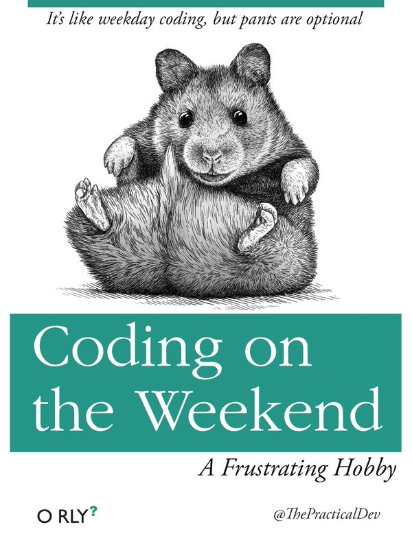

```{r SetUp, tidy=TRUE, results='hide', warning=FALSE, message=FALSE, echo=FALSE}
setwd("C:/Users/Sarah/Dropbox/Fitness/SummerPain")
options(stringsAsFactors=FALSE)

library(chron)
library(plyr)
library(knitr)
library(ggplot2)
library(scales)
library(reshape)
library(car)
```

I'm taking a break from my [coursera](http://lilithelina.tumblr.com/BCCIUoverview) project while we prepare to move to a bigger flat and I'm generally busy settling into my role as a postdoc with new projects on top of the old. Nevertheless, a little fun with programming at home can't be wrong, [right](https://twitter.com/ThePracticalDev/status/724290052029857796)?

```{r WeekendCoding, out.width="200px", fig.align='center'}

```

Therefore, I thought it could be fun to weekly visualise my progress with the [#SummerPain](https://twitter.com/search?f=tweets&vertical=default&q=%23summerpain&src=typd) hashtag on twitter. [#SummerPain](https://twitter.com/search?f=tweets&vertical=default&q=%23summerpain&src=typd) was started by [Helena](https://twitter.com/Helena_LB) just at the right time - I'd participated in [#40LentPain](https://twitter.com/search?f=tweets&q=%2340LentPain&src=typd) before Easter, but then we were on holiday for a week (with no exercise) and I came back with strep throat, so I hadn't exercised much since then. I hope that [#SummerPain](https://twitter.com/search?f=tweets&vertical=default&q=%23summerpain&src=typd) will help me get into the habit again, forcing me to find the time for workouts in my rather full schedule.

By the way, [#SummerPain](https://twitter.com/search?f=tweets&vertical=default&q=%23summerpain&src=typd) means 100 workouts this summer, starting May 14th, with September 15th as deadline, and a workout is defined as either 30 minutes of cardio or 15 minutes of strength training. I might not always adhere to these rules, though, but more on that in [week one](WeekOne.html).